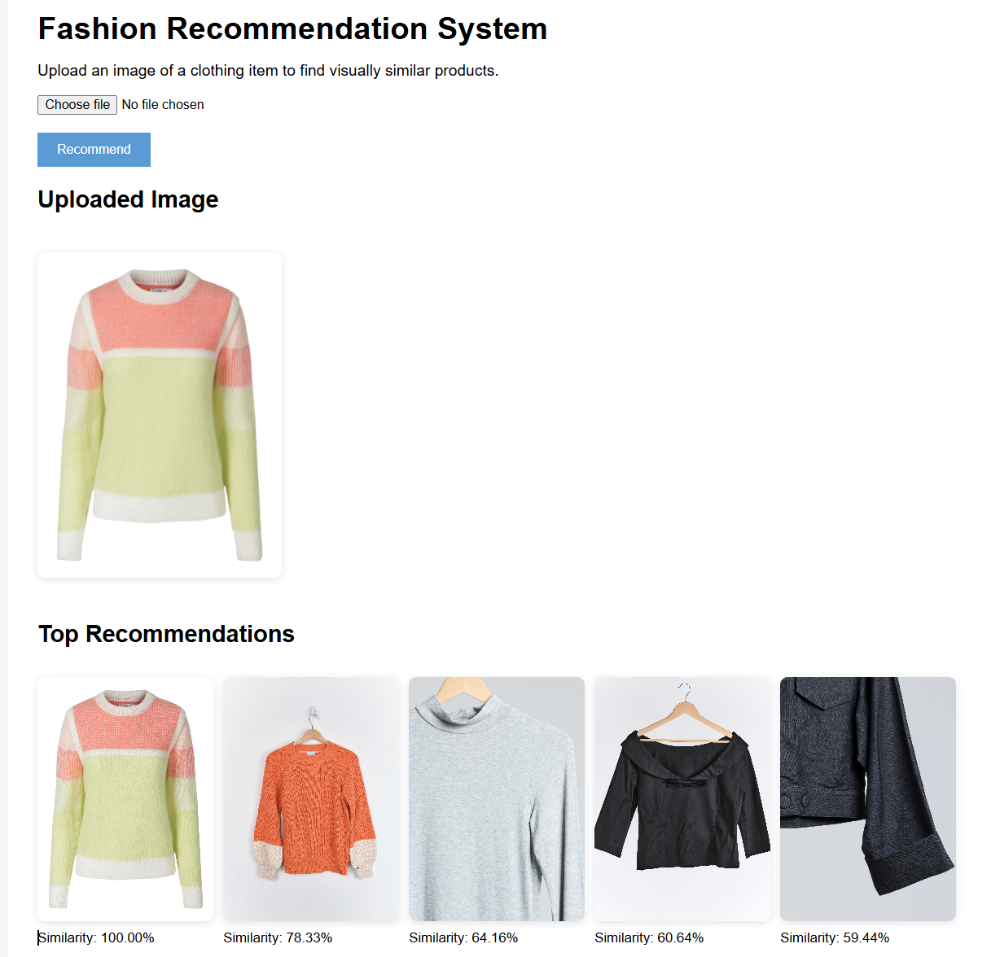

# Fashion Recommendation System

## Project Overview

This project is an AI-powered Fashion Recommendation System that recommends visually similar clothing items based on an uploaded image.

The system uses a pre-trained ResNet50 Convolutional Neural Network (CNN) to extract visual features from fashion images. These features are converted into numerical embeddings and compared using cosine similarity to identify the most visually similar products.

The application is deployed as a Flask web application where users can upload an image and receive the top five visually similar fashion recommendations.


## Features

- Upload a clothing image through a web interface
- Automatic image preprocessing
- Feature extraction using a pre-trained ResNet50 model
- Cosine similarity-based recommendations
- Top 5 visually similar fashion recommendations
- Interactive Flask web application


## Technologies Used

### Programming Language

* Python

### Machine Learning and Deep Learning

* PyTorch
* Torchvision
* ResNet50

### Data Processing

* Pandas
* Pillow (PIL)

### Web Application

* Flask
* HTML
* CSS


## Dataset

The project uses a fashion image dataset containing clothing product images.

### Dataset Statistics

| Stage                    | Images |
| ------------------------ | ------ |
| Raw Dataset              | 50,293 |
| Invalid Images Removed   | 0      |
| Duplicate Images Removed | 18,915 |
| Cleaned Dataset          | 31,378 |


## Deployment

The application was initially tested for deployment on Render. However, the free Render instance provides only 512 MB of RAM, which was insufficient for loading the PyTorch model and ResNet50 feature extractor.

The live application was therefore deployed using Hugging Face Spaces, which is better suited for machine learning applications.

### Deployment Note

The full local version uses a cleaned dataset of 31,378 fashion images.

Due to Hugging Face storage limitations, the deployed application uses a demo subset of 200 images. While this reduces the variety and quality of recommendations compared to the full dataset, the deployment demonstrates the complete recommendation pipeline, including image preprocessing, ResNet50 feature extraction, embedding generation, and cosine similarity-based retrieval.


# Project Workflow

## 1. Data Processing and Cleaning

The raw dataset contained 50,293 images.

Data cleaning involved:

- Checking for invalid images
- Detecting and removing duplicate images using MD5 hashing
- Creating a cleaned dataset containing 31,378 unique images

### Duplicate Detection

MD5 hashing was used to generate a unique fingerprint for each image file.

Images with identical hashes were considered exact duplicates and removed from the cleaned dataset.


## 2. Feature Creation

Before feature extraction, images were transformed using standard ImageNet preprocessing.

### Image Transformations

* Resize to 224 × 224 pixels
* Convert image to tensor
* Normalize using ImageNet mean and standard deviation values

The transformed images were then passed into the feature extraction model.


## 3. Model Building

A pre-trained ResNet50 Convolutional Neural Network was used as a feature extractor.


ResNet50 was selected because:

* It is pre-trained on ImageNet
* It provides strong visual feature representations
* It eliminates the need to train a CNN from scratch
* It performs well for image similarity tasks

The final classification layer was removed so the model could output a 2048-dimensional feature embedding instead of class predictions.


## 4. Output Functions

Each image was converted into a 2048-dimensional embedding.

The embeddings were saved to:

```text
embeddings/fashion_embeddings.pt
```

The corresponding image names were saved to:

```text
embeddings/fashion_image_names.csv
```


## 5. Recommendation System

When a user uploads an image:

1. The image is preprocessed
2. A feature embedding is generated using ResNet50
3. Cosine similarity is calculated against all dataset embeddings
4. The top five most similar products are returned

### Similarity Formula

Cosine similarity measures the angle between two embedding vectors.

Higher scores indicate greater visual similarity.


## 6. Testing and Final Output

The recommendation system was tested using multiple clothing categories, including dresses, trousers, jackets and casual wear.

Testing confirmed that the system was able to retrieve visually similar products based on colour, pattern, texture, garment shape and overall style.

The figure below shows an example recommendation generated by the system.



The uploaded image is converted into a 2048-dimensional feature embedding and compared against all dataset embeddings using cosine similarity. The five most visually similar fashion items are then returned to the user.


## 8. Web Application

A Flask web application was developed to allow users to interact with the recommendation system.

### User Workflow

1. Upload a clothing image
2. Click Recommend
3. View the uploaded image
4. View the top 5 similar fashion recommendations

## Limitations

- The recommendation system is based solely on visual similarity using image embeddings extracted from a pre-trained ResNet50 model and compared using cosine similarity.
- Product metadata such as brand, price, clothing category and user preferences are not used during recommendation generation.
- Recommendations are based only on the visual appearance of clothing items.
- Different views of the same product may still appear in the recommendations if multiple images of that product exist in the dataset.
- The model was not fine-tuned specifically for fashion recommendation and relies on features learned from the ImageNet dataset.
- The full cleaned dataset contains 31,378 images and requires approximately 4 GB of storage.
- As a result, the deployed application searches a smaller image collection than the full local version, which may reduce the variety of recommendations available to users.

## Future Improvements

Possible future enhancements include:

- Deployment using the full cleaned dataset 
- Category-based filtering
- Product metadata integration
- User preference tracking
- Hybrid recommendation models combining image and metadata features


GitHub: https://github.com/natalialungu22

Live Demo : https://huggingface.co/spaces/NataliaLungu22/fashion-recommendation-system

